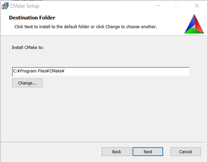

# 項目一覧

<!-- TOC -->
- Choreonoid インストール手順（for Windows10）
    - [事前準備](cnoid4win.html#advancePreparation "事前準備")
        - [必要なツールのインストール](cnoid4win.html#toolInstallation "必要なツールのインストール")
            - [Visual C++](cnoid4win.html#visualc++ "Visual C++")
            - [CMake](cnoid4win.html#installCmake "CMake")
        - [必要なライブラリのインストール](cnoid4win.html#libInstallation "必要なライブラリのインストール")
            - [Boost](cnoid4win.html#installBoost "Boost")
            - [Qt](cnoid4win.html#installQt "Qt")
    - [Visual StudioによるChoreonoidのソース取得](cnoid4win.html#getSource4Vs "Choreonoidソース取得")
    - [CMakeによるビルド設定](cnoid4win.html#setBuild "CMakeによるビルド設定")
    - [Visual Studioによるソリューションの読み込み](cnoid4win.html#readSolution "Visual Studioによるソリューションの読み込み")
    - [動作確認](cnoid4win.html#operatioCheck "動作確認")
<!-- /TOC -->

## 事前準備

### 必要なツールのインストール

#### Visual C++

Visual C++インストール手順

1. Visual C++の対応バージョンは、2015, 2017, 2019となっており、無料版のVisual Studio Communityを以下URLよりダウンロードします。 
<a href="https://visualstudio.microsoft.com/ja/free-developer-offers/">https://visualstudio.microsoft.com/ja/free-developer-offers/</a>  

2. ウェブブラウザにて上記URLにアクセスし、Visual Studio Communityの「無料ダウンロード」ボタンを押下します。 
  

3. 自動で"vs_community_….exe"がダウンロードします。 
※以下に表示されている「開始するためのヒントとリソース」は何も入力せずに「×」で閉じてください。 
 
  

4. ダウンロードフォルダより"vs_community_….exe"ファイルをダブルクリックします。 
  

5. 「続行」ボタンを押下します。 
  

6. 次の画面に遷移するまで待機します。 
  

7. 「C++によるデスクトップ環境」にチェックを入れ、「インストール」ボタン押下します。 
  

8. インストールが完了するまで待機します。 
  

9. 再起動を求められるので、「再起動」ボタンを押下します。 
  

#### CMake

CMakeのインストール手順

1. CMakeの最新バージョンは、3.18.0となっており、以下URLよりWindows版のインストーラをダウンロードします。 
<a href="https://cmake.org/download/">https://cmake.org/download/</a>  

2. ウェブブラウザにて上記URLにアクセスし、Windows win64-x64 Installerの「cmake-3.18.0-rc4-win64-x64.msi」リンクを押下します。 
  

3. 自動で”cmake-3.18.0-rc4-win64-x64.msi”がダウンロードされます。 
  

4. ダウンロードフォルダより” cmake-3.18.0-rc4-win64-x64.msi”ファイルをダブルクリックします。 
  

5. 「Next」ボタンを押下します。 
  

6. 「I accept the terms in the License Agreement」にチェックを入れます。 
  

7. 「Next」ボタンを押下します。 
  

8. 「Add CMake to the system PATH for all users」を選択します。 
  

9. 「Next」ボタンを押下します。 
  

10. フォルダパスを変更せずに、「Next」ボタンを押下します。 
  

11. 「Install」ボタンを押下します。 
  

12. インストールが完了するまで待機します。 
  

13. インストールが完了したら、「Finish」ボタンを押下します。 
  

### 必要なライブラリのインストール

#### Boost

Boostのインストール手順

1. Boostライブラリの最新版は、1.73.0となっており、を以下URLよりインストーラをダウンロードします。 
<a href="https://www.boost.org/users/download/">https://www.boost.org/users/download/</a>  

2. ウェブブラウザにて上記URLにアクセスし、OTHER DOWNLOADSの「Prebuilt windows binaries.」リンクを押下します。 
  

3. 「Download Latest Version」ボタンは押下しないでください。 
  

4. 最新版の「1.73.0」フォルダを押下します。 
  

5. 「boost_1_73_0-msvc-14.2-64.exe」リンクを押下します。 
  

6. 自動で” boost_1_73_0-msvc-14.2-64.exe”がダウンロードされます。 
  

7. ダウンロードフォルダにて” boost_1_73_0-msvc-14.2-64.exe”をダブルクリックします。 
  

8. 「詳細情報」を押下すると「実行」ボタンが表示されます。 
  

9. 「実行」ボタンを押下します。 
  

10. フォルダパスは変更せずに「Next」ボタンを押下します。 
  

11. インストールが完了するまで待機します。 
  

12. インストールが完了したら「Finish」ボタンを押下します。 
  

#### Qt

Qtのインストール手順

1. Qtの最新版は、5.13.0となっており、以下URLよりWindows版のQtのインストーラをダウンロードします。 
※最小要件：5.10以上 
<a href="https://www.qt.io/download">https://www.qt.io/download</a>  

2. ウェブブラウザにて上記URLにアクセスします。 
  

3. Downloads for open source usersの「Go open source」ボタンを押下します。 
  

4. 「Download the Qt Online Installer」ボタンを押下します。 
  

5. 対象OSのインストーラが表示されます。 
※以下ではWindows OSのインストーラが表示されています。 
  

6. 「Download」ボタンを押下します。 
  

7. 自動で” qt-unified-windows-x86-3.2.3-online.exe”がダウンロードします。 
  

8. ダウンロードフォルダにて” qt-unified-windows-x86-3.2.3-online.exe”をダブルクリックします。 
  

9. 「Next」ボタンを押下します。 
  

10. 必須項目を入力します。（アカウント登録が必須） 
  

11. 必須項目を入力後「Next」ボタンを押下します。 
【Qtアカウントを既に持っている方】 
LoginにEmail, Passwodを入力後、「I accept the service terms.」にチェックを入れ、「Next」ボタンを押下します。 
 
【Qtアカウントを持っていない方】 
Sign-upにEmail, Password※, Confirm Passwordを入力後、「I accept the service terms.」にチェックを入れ、「Next」ボタンを押下します。 
入力したメールアドレスにアカウント登録メールが届くので、リンクよりアカウントの登録を完了させます。 
アカウント登録完了後、再度「Next」ボタンを押下します。 
※パスワードは、7桁以上、大文字、小文字、数字、記号の4パターンの内最低3パターンを使用する必要があります。 
  

12. 「I have read and approve the obligations of using Open Source Qt」にチェックを入れます。
  

13. 「次へ」ボタンを押下します。 
  

14. 「次へ」ボタンを押下します。 
  

15. 「Disable sending pseudonymous usage statistics in Qt Creator」を選択し、「次へ」ボタンを押下します。 
  

16. インストールフォルダは変更せずに「次へ」ボタンを押下します。 
  

17. "Qt 5.15.0”の”MSVC 2019 64-bit"にチェックを入れ、「次へ」ボタンを押下します。 
  

18. 「I have read and agree to the terms contained in the license agreements」を選択します。 
  

19. 「次へ」ボタンを押下します。 
  

20. "Qt"という名称の新しいフォルダを指定し「次へ」ボタンを押下します。 
  

21. 「インストール」ボタンを押下します。 
  

22. インストールが完了するまで待機します。 
  

23. 「Launch Qt Creator」のチェックを外します。 
  

24. 「完了」ボタンを押下します。 
  

## Visual StudioによるChoreonoidのソース取得

Choreonoidのソース取得方法

1. Visual Studio 2019を起動後、「後で行う。」を押下します。 
  

2. 開発設定を”Visual C++”に変更します。 
※配色のテーマの選択は任意で変更を行ってください。 
  

3. 「Visual Studioの開始」ボタンを押下します。 
  

4. 30日間の試用期間が終了している場合、「サインイン」ボタンを押下しMicrosoftアカウントでサインインします。 
※アカウントがない場合、「作成してください。」のリンクより作成を行ってください。 
  

5. 「閉じる」ボタンを押下します。 
  

6. 「コードなしで続行→」を押下します。 
  

7. 「ソリューションエクスプローラー」が表示されているので、「チームエクスプローラー」を表示します。 
  

8. 「メニュー」→「表示」→「チームエクスプローラー」を選択します。 
  

9. 「コンセント」ボタンを押下します。 
  

10. ローカルGitリポジトリの「クローン」を押下します。 
  

11. Gitリポジトリを指定します。 
※Choreonoidリポジトリ：<a href="https://github.com/choreonoid/choreonoid.git">https://github.com/choreonoid/choreonoid.git</a> 
  

12. Choreonoidリポジトリをダウンロードするフォルダを指定し、「クローン」ボタンを押下します。 
※フォルダパス： C:\Users\ユーザ名\choreonoid 
  

13. リポジトリを複製が完了するまで待機します。 
  

14. リポジトリの複製が完了すると画像のメッセージが表示されます。 
  

15. 「同期」ボタンを押下します。 
  

16. 「プル」を押下します。 
  

17. リポジトリが最新状態の場合、画像のメッセージが表示されます。 
  

## CMakeによるビルド設定

ビルド設定手順

1. スタートメニューから「CMake」→「CMake (cmake-gui)」を押下します。 
  

2. 「Where is the source code:」にChoreonoidのダウンロードフォルダを指定します。 
「Where to build the binaries:」にChoreonoidのダウンロードフォルダ直下のbuildフォルダを指定します。 
※Where is the source code：C:\Users\ユーザ名\choreonoid 
  Where to build the binaries：C:\Users\ユーザ名\choreonoid\build 
  

3. 「Configure」ボタンを押下します。 
  

4. 「Yes」ボタンを押下します。 
  

5. 「Specify the generator for this project」に”Visual Studio 16 2019”を選択し、「Finish」ボタンを押下します。 
  

6. "Configuring done"のメッセージが表示されれば正常終了です。 
  

7. "CMAKE_INSTALL_PREFIX"を変更します。 
※CMAKE_INSTALL_PREFIX：C:\Users\ユーザ名\choreonoid\program 
  

8. 「Configure」ボタンを押下します。 
  

9. 「Generate」ボタンを押下します。 
  

10. "Generating done"のメッセージが表示されれば正常終了です。 
  

## Visual Studioによるソリューションの読み込み

ソリューションの読み込み方法

【既にVisual Studioを起動している場合】 
1. 「メニュー」→「ファイル」→「開く」→「プロジェクト/ソリューション」を押下します。 
  

2. ビルドフォルダ内の"Choreonoid.sln"ファイルを選択し「開く」ボタンを押下します。 
  

【Visual Studioを起動していない場合】 
3. ビルドフォルダに移動し、"Choreonoid.sln"ファイルをダブルクリックします。 
  

4. "Choreonoid.sln"を起動すると、ソリューションエクスプローラーにプロジェクト一覧が表示されます。 
  

5. ソリューション構成：Release、ソリューションプラットフォーム：x64に変更します。 
  

6. 「メニュー」→「ビルド」→「ソリューションのビルド」を押下します。 
  

7. 出力ビューに表示されているビルド結果の”失敗”が0なら正常終了です。 
  

8. ソリューションエクスプローラーの"INSTALL"を選択します。 
  

9. 右クリックし「ビルド」を選択します。 
  

10. 出力ビューに表示されているビルド結果の”失敗”が0なら正常終了です。 
  

## 動作確認

ビルド設定(for CMake)

1. インストールフォルダの"bin"フォルダにある"choreonoid.exe"ファイルをダブルクリックします。 
※インストールフォルダ：C:\Users\ユーザ名\choreonoid\program\ 
  

2. 画像のようなChoreonoid画面が起動します。 
  

3. 「メニュー」→「プロジェクトの読み込み」を押下します。 
  

4. "Tank.cnoid"を選択し「読み込み」ボタンを押下します。 
  

5. 「シミュレーション開始」ボタンを押下します。 
  

6. 仮想ジョイスティックビューをクリックしアクティブにした後、キーボードのE(前進), S(左旋回), F(右旋回), D(後退)等を押してTankが動作することを確認してください。 
※キーを押している間のみ動作し続けます。 
  

