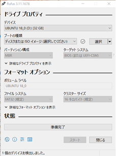
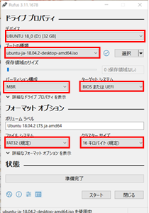
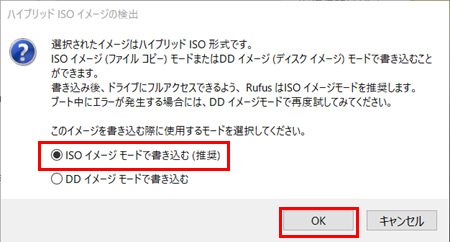
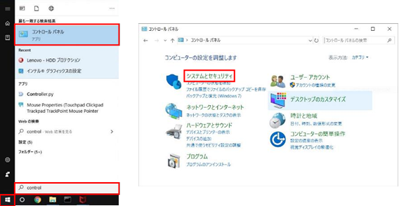

# 項目一覧

<!-- TOC -->
- Ubuntu インストール手順
    - [インストーラの作成](ubuntu.html#createInstaller "インストーラの作成")
    - [電源オプションの変更](ubuntu.html#changePowerOption "電源オプションの変更")
    - [パーティションの未割り当て領域の設定](ubuntu.html#setPartition4Win "パーティションの未割り当て領域の設定")
    - [BIOSの設定](ubuntu.html#setBios "BIOSの設定")
    - [パーティション構成の設定](ubuntu.html#setPartition4Ubn "パーティション構成の設定")
    - [Ubuntu 18.04 LTSのインストール](ubuntu.html#installUbuntu "Ubuntu 18.04 LTSのインストール")
    - [BIOSの設定を戻す](ubuntu.html#changeBios "BIOSの設定を戻す")
<!-- /TOC -->

## インストーラの作成
インストーラを作成するには以下のものが必要となります。
<!-- TOC -->
- USBメモリ（書き込むISOイメージファイルサイズ以上の容量が必要）
- Windows8以上のPC（USB差込口が必要）
- Rufus（起動可能なUSBメモリを作成するOSS）
- ISOイメージファイル（Ubuntu 18.04LTS）
<!-- TOC -->
 
1. RufusとISOイメージファイルは、以下のサイトより最新版をダウンロードします。 
    - Rufus : [https://rufus.akeo.ie/](https://rufus.akeo.ie/) 
    - ISOイメージファイル : [https://www.ubuntulinux.jp/News/ubuntu1804-ja-remix](https://www.ubuntulinux.jp/News/ubuntu1804-ja-remix)  

2. ダウンロードした「rufus.exe」をダブルクリックし起動します。
起動すると以下のダイアログが表示されるので、以下の項目を設定し「スタート」ボタンを押下します。

  

<table border="1">
    <tr>
        <th>項目名</th>
        <th>値</th>
    </tr>
    <tr>
        <td>デバイス</td>
        <td>インストーラ用のUSBを選択 ※使用するUSBによりデバイス名は異なる</td>
    </tr>
    <tr>
        <td>ブートの種類</td>
        <td>「選択」ボタンからISOイメージファイルを選択</td>
    </tr>
    <tr>
        <td>パーティション構成</td>
        <td>"MBR" を選択</td>
    </tr>
    <tr>
        <td>ターゲットシステム</td>
        <td>"BIOS または UEFI" を選択</td>
    </tr>
    <tr>
        <td>ファイルシステム</td>
        <td>"FAT32（規定）" を選択</td>
    </tr>
    <tr>
        <td>クラスターサイズ</td>
        <td>"16キロバイト(規定)" を選択</td>
    </tr>
</table>  

  

3. 「ISOHybridイメージを検出しました」ダイアログが表示されるので、"ISOイメージモードで書き込む（推奨）"を選択し、「OK」ボタンを押下します。 
  

## 電源オプションの変更
1. 「Windowsロゴ」キーをクリックし、スタートメニューを表示します。 "control"と入力すると"コントロールパネル"が表示されるのでクリックします。 
  

2. 「コントロールパネル」⇒「システムとセキュリティ」⇒「電源オプション」⇒「電源ボタンの動作の変更」を選択します。 
  

3. "現在利用可能ではない設定を変更します"をクリックし、「シャットダウン設定」の「高速スタートアップを有効にする」のチェックを外してください。
 
  

## パーティションの未割り当て領域の設定
1. 「コントロールパネル」⇒「システムとセキュリティ」⇒「管理ツール」⇒「ハードディスク パーティションの作成とフォーマット」を選択します。 
  

2. "Windows (C:)"を選択し右クリックし、"ボリュームの縮小"を選択します。 
 
  

3. "縮小する領域のサイズ" に40960 (MB) と入力し「縮小」ボタンを押下します。未割り当て領域が作成されていれば完了となります。 
 
 
  

## BIOSの設定

1. PCに「インストーラの作成」で作成したUSBインストーラを接続した状態でPCを再起動します。「F1」キーを何度か押しているとBIOSの設定画面が表示されます。再起動時のBIOS起動キーはPCによって異なります。 
 ※以下の方法は全てのPCで共通しているBIOS画面の起動方法となります。 
    1 「スタートメニュー」→「電源」→「Shiftを押した状態で再起動をクリック」すると「オプションの選択」画面が表示されます。 
    2 「トラブルシューティング」を選択すると「トラブルシューティング」画面が表示されます。 
    3 「詳細オプション」を選択すると「詳細オプション」画面が表示されます。 
    4 「UEFIファームウェアの設定」を選択すると「UEFIファームウェアの設定」画面が表示されます。 
    5 「再起動」ボタンを押下すると、BIOS画面が起動します。 

2. BIOS設定画面へアクセスできたら、Bootの順番を変更します。"USB Flash Disk"を一番上に移動させます。 
  
3. 保存のキーを押下すると、"Exit Saving Changes?" と聞かれるので、"Yes" を選択し再起動します。 

4. USBのインストーラが起動するので、"Try Ubuntu without installing" を選択しUbuntuを起動します。 

## パーティション構成の設定
1. インストーラのUbuntuが起動したら、左端にランチャーが表示されるので、左下の「アプリケーションを表示する」をクリックします。 

2. 検索欄に "gparted" と入力すると "GParted パーティション編集ツール"が表示されるのでクリックし起動します。 

3. 未割り当てのパーティションを選択し、「パーティション」⇒「新規」(またはファイルアイコン)を選択します。新規パーティションの作成で、以下の通り設定したら「追加」ボタンを押下します。 

<table border="1">
    <tr>
        <th>項目名</th>
        <th>値</th>
    </tr>
    <tr>
        <td>新しいサイズ</td>
        <td>200MB</td>
    </tr>
    <tr>
        <td>Partition name</td>
        <td>ESP</td>
    </tr>
    <tr>
        <td>ファイルシステム</td>
        <td>fat32</td>
    </tr>
    <tr>
        <td>ラベル</td>
        <td>ESP</td>
    </tr>
</table>  

4. 新しくパーティションを作成したら、「編集」⇒「保留中の全ての操作を適用する」(またはチェックアイコン)を選択します。 
作成したパーティション：ESPを選択し、「パーティション」⇒「フラグを編集」(または右クリックから"フラグを編集")を選択します。 
チェックダイアログが表示されるので、"boot" と "esp"にチェックを入れ「閉じる」を押下します。 

## Ubuntu 18.04 LTSのインストール
1. Ubuntuのインストールと同時にソフトウェアのインストールを行うのでネットワークに接続しておきます。 

2. デスクトップ上に「Ubuntu 18.04 LTSのインストール」があるので、ダブルクリックし起動します。起動したら「ようこそ」画面が表示されるので、"日本語" を選択し「続ける」ボタンを押下します。 

3. 次に「キーボードレイアウト」が表示されるので、"日本語"を選択し「続ける」ボタンを押下します。 

4. 次に「アップデートと他のソフトウェア」が表示されるので、"通常のインストール"、"その他オプション"2項目にチェックを入れ、"Configure Secure Boot"のチェックを外し、「続ける」ボタンを押下します。 

5. 「インストールの種類」が表示されたら、"それ以外"を選択し「続ける」を押下します。 

6. 空き領域を選択し、「+」ボタンを押下するとパーティション編集ダイアログが表示されるので、下表の通りパーティションを設定します。 
※1 WindowsとUbuntuのデュアルブートを行う場合、「変更」ボタンからマウントポイントの設定を"/windows"とすることでUbuntuからWindowsにアクセス可能。UbuntuからWindowsにアクセスしない場合、設定は不要となります。 
※2 どのパーティションがWindowsのドライブかはパーティションサイズで判断します。 

<table border="1">
    <tr>
        <th rowspan="2">パーティション</th>
        <th colspan="5">項目名</th>
    </tr>
    <tr>
        <th>サイズ</th>
        <th>新しいパーティションのタイプ</th>
        <th>新しいパーティションの場所</th>
        <th>利用方法</th>
        <th>マウントポイント</th>
    </tr>
    <tr>
        <th>Windows</th>
        <td colspan="3" align="center">変更なし</td>
        <td>ntfs</td>
        <td>/windows</td>
    </tr>
    <tr>
        <th>OS(Ubuntu）</th>
        <td>20480MB</td>
        <td colspan="2" rowspan="4" align="center">デフォルト</td>
        <td>ext4</td>
        <td>/</td>
    </tr>
    <tr>
        <th>ホームディレクトリ</th>
        <td>19356MB</td>
        <td>ext4</td>
        <td>/home</td>
    </tr>
    <tr>
        <th>スワップ領域</th>
        <td>1024MB</td>
        <td>スワップ領域</td>
        <td align="center">−</td>
    </tr>
    <tr>
        <th>BIOS</th>
        <td>100MB</td>
        <td>予約済みBIOSブート領域</td>
        <td align="center">−</td>
    </tr>
</table>  

7. 設定が完了したら、「インストール」ボタンを押下します。 

8. 「続ける」ボタンを押下します。 

9. 「どこに住んでいますか？」が表示されたら、"Tokyo"と入力し「続ける」ボタンを押下します。 

10. 「あなたの情報を入力してください」が表示されたら、全項目入力し「続ける」ボタンを押下します。 
注 : インストール時はパスワードの設定が英数字のみの構成でも問題ないです。ただし、インストール後に変更を行う場合、大文字、小文字、英数字、記号の組み合わせでないと変更を行えません。 

11. 下図の画面が表示されたら、「インストール完了」画面が表示されるまで待機します。 

12. 「インストールが完了しました」が表示されたら、「今すぐ再起動する」ボタンを押下します。 

## BIOSの設定を戻す
1. BIOSの設定で行った起動方法でBIOSを起動します。

2. 常にWindowsを起動したい（ほとんどUbuntuを使用しない方）場合、Windowsを一番上に移動させて、BIOS設定を保存してください。 
デュアルブートによる起動を行いたい場合、一番上にUbuntu、その次にWindowsの順に変更してください。 
